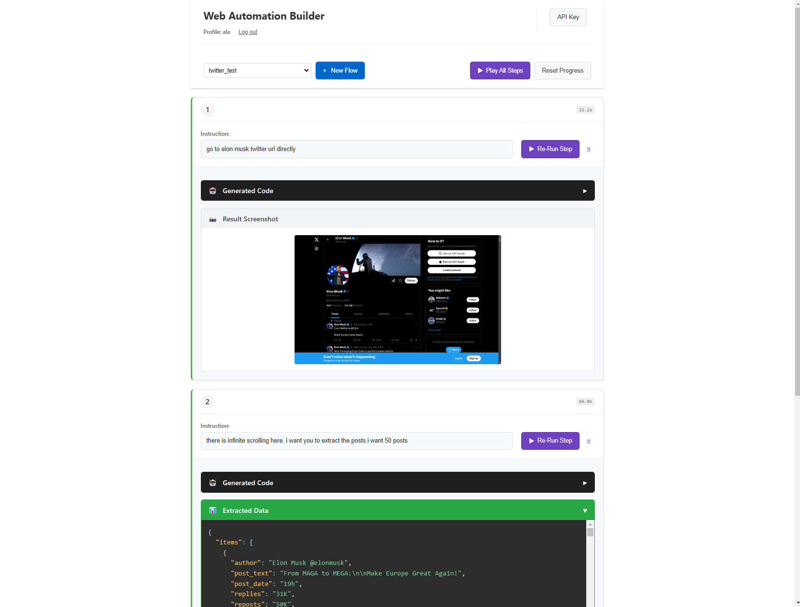
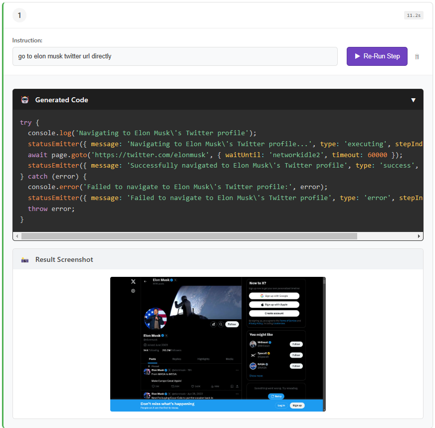
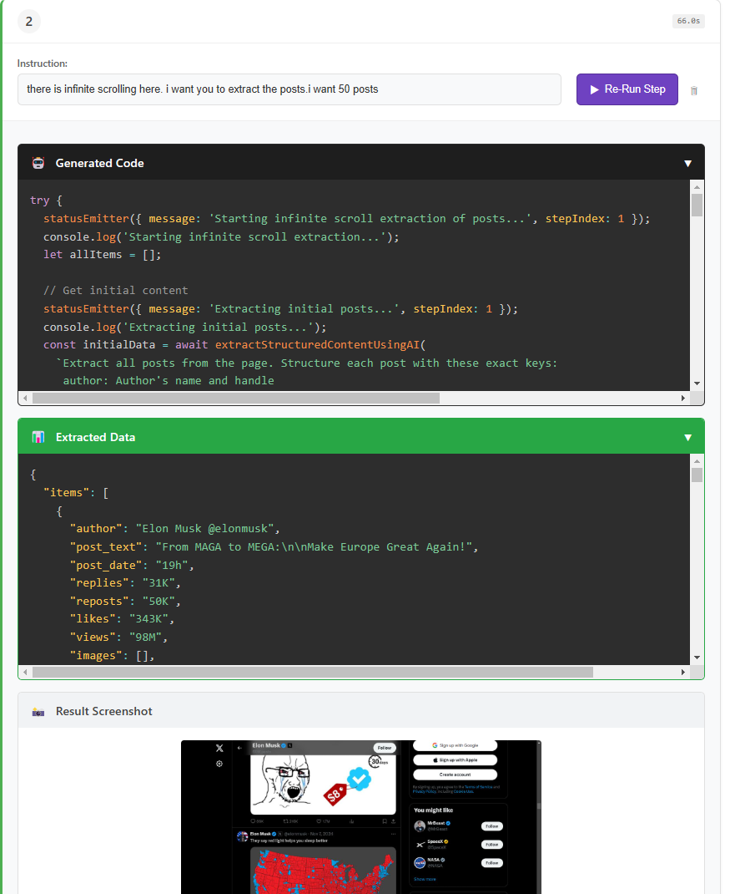

# Web Automation Builder

A browser automation tool that lets you create automation flows using natural language instructions. Write what you want to do in plain English, and the AI will generate and execute the appropriate automation code.

## How it Works

1. User enters natural language instruction
2. Google Gemini AI converts it to Puppeteer code
3. Code executes in automated browser
4. Results (screenshots, data) returned to user

The AI has access to helper functions for common tasks like element selection and data extraction.


## Benchmarks

Successfully automated common web tasks like:
- Scraping Instagram stories 
- Extracting 1000 Airbnb listings while handling infinite scroll
- Collecting 100 posts from Twitter profiles
- Filling out Facebook signup forms


## Examples



Here's an example of how the AI automatically generated and executed browser automation code based on natural language prompts:

### Step 1: Navigate to Profile
**Prompt:** "Go to Elon Musk's Twitter URL directly"

The AI generated and executed this code in an automated browser:



### Step 2: Extract Posts with Infinite Scroll
**Prompt:** "There is infinite scrolling here. I want you to extract the posts. I want 50 posts"

The AI generated and executed this sophisticated scrolling and extraction code:



**Example Extracted Data:**
```json
{
  "items": [
    {
      "author": "Elon Musk @elonmusk",
      "post_text": "I fully endorse President Trump and hope for his rapid recovery",
      "post_date": "Jul 13, 2024",
      "replies": "86K",
      "reposts": "399K",
      "likes": "2.3M",
      "views": "222M",
      "images": [
        "https://pbs.twimg.com/amplify_video_thumb/1812256938383568896/img/_R5F6myzmRblxf_8.jpg"
      ],
      "videos": [
        "https://video.twimg.com/amplify_video/1812256938383568896/vid/avc1/1280x720/example.mp4"
      ]
    },
    {
      "author": "Elon Musk @elonmusk",
      "post_text": "The future is gonna be so 🔥🇺🇸🇺🇸",
      "post_date": "Nov 6, 2024",
      "replies": "59K",
      "reposts": "230K",
      "likes": "2.6M",
      "views": "159M",
      "images": [
        "https://pbs.twimg.com/media/GbrTB8GXEAYrk2N?format=jpg&name=small",
        "https://pbs.twimg.com/media/GbrTB8HWAAAbc12?format=jpg&name=small"
      ],
      "videos": []
    },
    {
      "author": "Elon Musk @elonmusk",
      "post_text": "SpaceX Starship Launch",
      "post_date": "Aug 6, 2024",
      "replies": "45K",
      "reposts": "102K",
      "likes": "894K",
      "views": "12.4M",
      "images": [
        "https://pbs.twimg.com/amplify_video_thumb/1820602688117354497/img/YZTX78aqXVB2dkG3.jpg"
      ],
      "videos": [
        "https://video.twimg.com/amplify_video/1820602688117354497/vid/avc1/1280x720/launch_video.mp4"
      ]
    }
  ]
}
```


## Setup

1. Clone the repository
2. Install dependencies:
```bash
npm install
```
3. Start the server:
```bash
npm start
```
4. Open `http://localhost:3000` in your browser

## Usage

1. Create a profile when first launching the app
2. Get your Gemini API key from [Google AI Studio](https://aistudio.google.com/app/apikey)
3. Click the "API Key" button in the top right and enter your key
4. Click "New Flow" and give it a name
5. Enter instructions in natural language, for example:
   - "Go to wikipedia.org"
   - "Type 'artificial intelligence' in the search box"
   - "Click the first search result"
6. Each step will be executed automatically and show:
   - Generated automation code
   - Screenshot of the result
   - Any extracted data
7. Use "Play All Steps" to run the entire flow from start to finish

## Tips

- Be specific in your instructions (e.g., "Click the blue 'Submit' button" instead of just "Click submit")
- For data extraction, specify the format you want (e.g., "Extract all product titles and prices into a list")
- Use the reset button if you need to start over
- Check the screenshots to verify each step worked as expected
